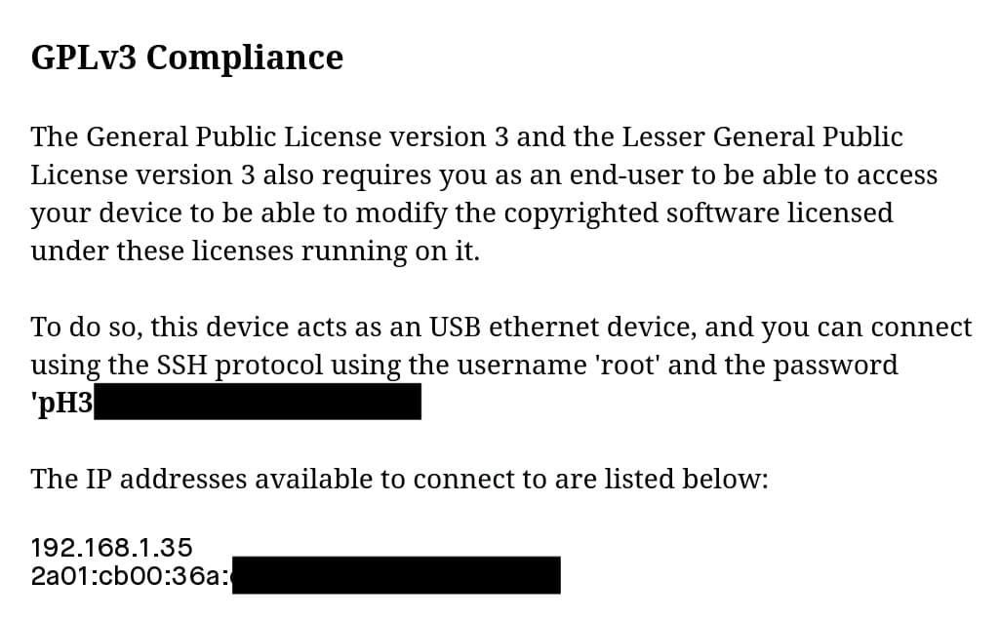
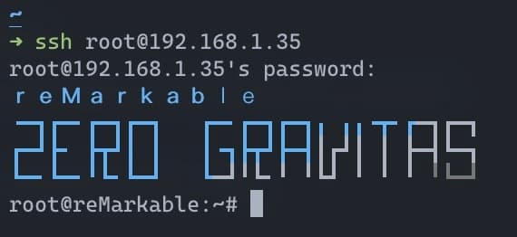
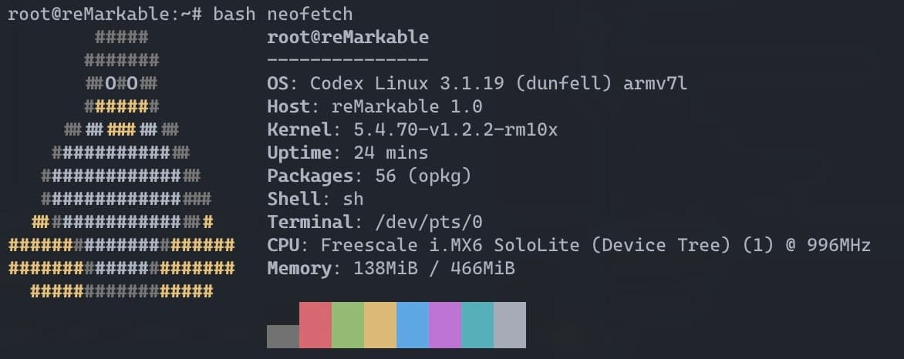
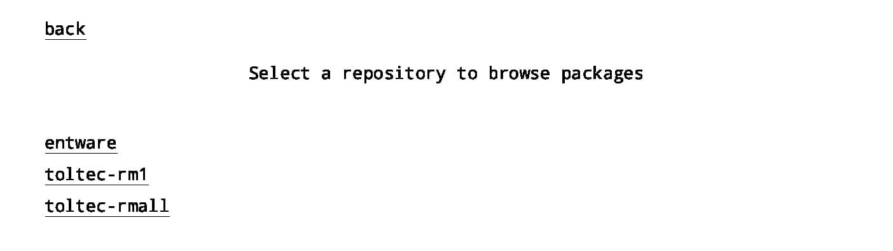
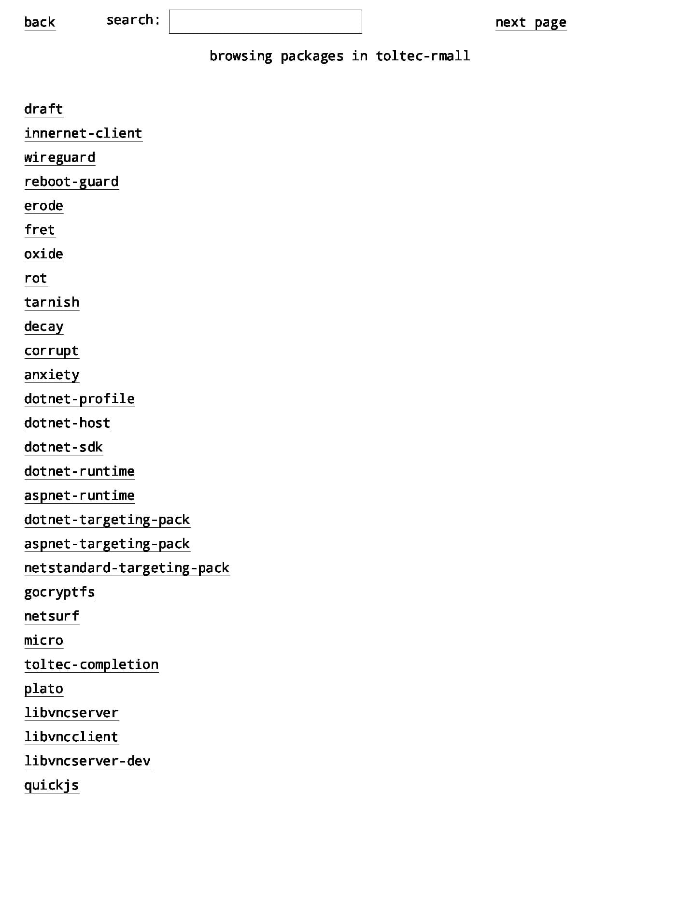
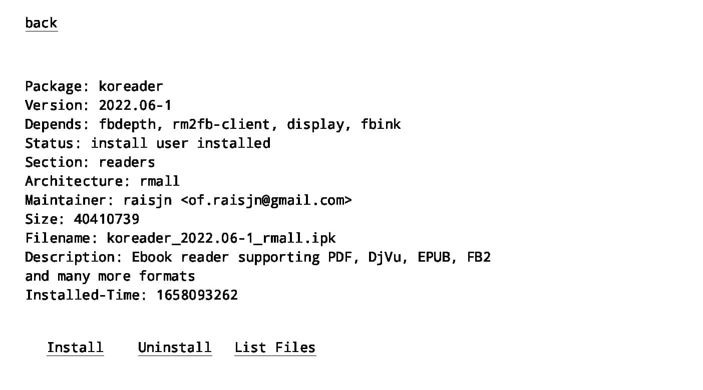

A few weeks ago, I managed to get my hands on a reMarkable tablet.

After using it for a day of two, I found the software to be too limiting to make full use of what such a tablet could offer. This prompted me to start looking into what was available in terms of custom software for the device, and to my surprise, there is quite a lot of it available.

## Connecting via SSH

To follow the GPLv3 license in the software used by the reMarkable, SSH access is granted to you. The logins can be found at the bottom of the page located under `Settings > Help > Copyright and licenses`.


With this information, it is now possible to connect to the tablet if it is connected to the same network as your computer.


Using neofetch, we can see that the reMarkable is using a Linux based OS called Codex Linux with a Freescale i.MX6 SoloLite CPU.


## Toltec

Toltec allows you to access packages from the [Entware](https://entware.net/about.html) and Toltec repository through the `opkg` package manager. The installation instructions can be found on [their website](https://toltec-dev.org/).

We can install `nao`, a graphical front-end for `opkg` with the following command:

```bash
opkg install nao
```

We can also install `remux` to have a quick task manager.

```bash
opkg install remux
```

Pressing the middle button on the tablet will now open the task manager and allow you to open installed applications.

Starting `nao`, we are greeted with 3 different repositories:



- entware, which contains generic Linux packages.
- toltec-rm1, which contains packages specifically for the reMarkable 1.
- toltec-rmall, which contains packages for all reMarkable devices.

Clicking on the `toltec-rmall` will show a list of packages that can be installed.


We can now install packages such as KOReader, which allows us to read more e-books formats such as CBR and CBZ or Mobi files, without being connected via SSH.


In total, more than 1500 packages are available, ranging from Apache, to Node.js and (obviously) Doom, which has been ported to run on the tablet.

## Interesting packages

- [harmony](https://rmkit.dev/apps/harmony), a sketching app with support for procedural drawing.
- [fingerterm](https://github.com/dixonary/fingerterm-reMarkable), a terminal emulator for the reMarkable.
- [recrossable](https://github.com/sandsmark/recrossable), a crossword game.
- [Puzzles](https://rmkit.dev/apps/puzzles), a collection of puzzle games.
- [wordlet](https://rmkit.dev/apps/wordlet), a port of Wordle.
- [Dumbskull](https://rmkit.dev/apps/dumbskull), a dungeon crawler.
- [minesweeper](https://rmkit.dev/apps/minesweeper), a minesweeper game.

The [awesome reMarkable](https://github.com/reHackable/awesome-reMarkable) repository on GitHub also maintains a list of software related to the tablet, such as allowing backups through Git or creating custom calendars for the tablet.
