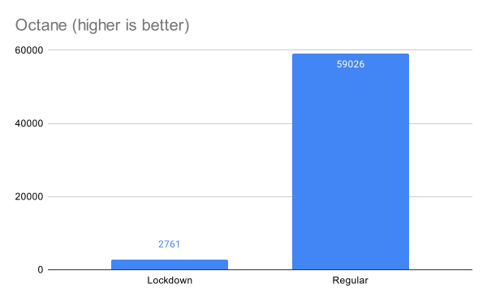
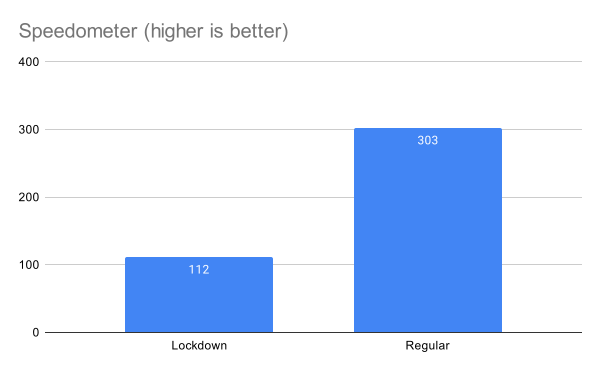
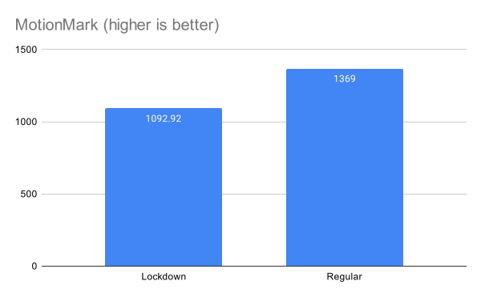

The iOS 16 beta 3 introduced a new privacy feature: Lockdown Mode. The idea is to disable some features in iOS to reduce the possibility of privacy related attacks.

Apple also gives a rough list of the features disabled in Lockdown, including one which caught my eye:

> Web browsing: Certain complex web technologies, like just-in-time (JIT) JavaScript compilation, are disabled unless the user excludes a trusted site from Lockdown Mode[1](https://www.apple.com/newsroom/2022/07/apple-expands-commitment-to-protect-users-from-mercenary-spyware/).

The first thing I thought was that disabling JavaScript JIT compilation in JavaScriptCore would cause a major drop in performance, given the amount of JavaScript used in webpages. I wanted to test how big this impact would be.

The second was figuring out what's included in "Certain complex web technologies," since Apple did not provide an explanation.

## Disabled features

Through manual testing and Modernizr feature detection, the following features get disabled in Lockdown mode:

- [WebAssembly](#webassembly)
- [MP3 Playback](#mp3-playback)
- [MathML](#mathml)
- [Gamepad API](#gamepad-api)
- [Web Audio API](#web-audio-api)
- [WebGL](#webgl)
- [JPEG 2000](#jpeg-2000)
- [Speech Recognition API](#speech-recognition-api)
- [MediaDevices.getUserMedia()](#mediadevicesgetusermedia)
- [RTCDataChannel](#rtcdatachannel)
- [PDF Viewer](#pdf-viewer)
- [SVG Fonts](#svg-fonts)

Most of these have been disabled as a way to reduce possible user tracking.

Let's go over each of the feature to make sense of why they were disabled.

### WebAssembly

WASM, while incredibly powerful, can be used to very quickly and effectively fingerprint clients through canvas rendering discrepancies.[2](https://github.com/drbh/wasm-fingerprint) or local ports scanning[3](https://infosecwriteups.com/identify-website-users-by-client-port-scanning-using-webassembly-and-go-e9798b4aa05c). among other options and make them harder for ad blockers to detect. This can be a major pain point for Blazor sites and other frameworks relying on Web Assembly since they simply won't work without a JavaScript fallback.

### MP3 Playback

MP3 support is a bit of an outlier for me here. Most browsers support MP3 playback and disabling it could allow to identify the target as a macOS or iOS device running in Lockdown mode. One possible option would be avoiding some crafted MP3 decoding attacks. This will break sites that use MP3 playback without some fallback to AAC or OGG formats.

### MathML

MathML rendering can be slightly different on a per-device basis, which might allow an attacker to track a device through the `DOMRect` object of a MathML render[4](https://privacycheck.sec.lrz.de/active/fp_ml/fp_ml.html).

### Gamepad API

Without fingerprinting mitigation, the Gamepad API can be used to track users through the `id` and `buttons` property once users have interacted with the page[5](https://www.xda-developers.com/chrome-gamepad-api-changes/). This will break most in browser games and game streaming platforms that use a controller to play games.

### Web Audio API

The Web Audio API can be used to fingerprint Safari users through the `webkitOfflineAudioContext` interface and signal variation[6](https://fingerprint.com/blog/audio-fingerprinting/).

### WebGL

WebGL fingerprinting is one of the oldest way to track users through "unconventional" methods with rendering discrepancies between individual devices, even running the same hardware. The `WebGLRenderingContext` can also be used to detect user hardware and support WebGL versions[7](https://privacycheck.sec.lrz.de/active/fp_wg/fp_webgl.html).

### JPEG 2000

JPEG 2000 support is nowadays a sure way to identify a device as running Safari since it is the only browser supporting it[8](https://caniuse.com/jpeg2000).

### Speech Recognition API

While the [Web Speech API](https://developer.mozilla.org/en-US/docs/Web/API/Web_Speech_API/Using_the_Web_Speech_API) runs on device on macOS and iOS, it can be used to record an unsuspecting user.

This isn't related to the iOS dictation or Siri, both of which will still work just fine and aren't accessible to websites. A demo of the Web Speech API by Google can be found [at this link](https://www.google.com/intl/en/chrome/demos/speech.html).

### MediaDevices.getUserMedia()

The `MediaDeviceInfo` can be used to track user across sessions on a single origin through its `deviceId` property of a webcam, speaker, or camera. Access to said device could also be a privacy risk. This means that most sites requiring access to the microphone or cameras of the device won't work.

### RTCDataChannel

The WebRTC API can be used to leak the public and local IP of a device, even under a VPN, when communicating with a STUN server[9](https://developer.mozilla.org/en-US/docs/Web/API/WebRTC_API/Connectivity).

### PDF Viewer

The WebKit PDF viewer is disabled, clicking on a document will instead trigger a download. It is still possible to open them with the Files application once the download completed.

### SVG fonts

SVG fonts are disabled, this is probably a similar situation to [JPEG 2000](#jpeg-2000) where only Safari supports them.

These changes are applied to all iOS and iPadOS browsers since they have to use WebKit under the hood.

Using Chrome, Firefox, or Brave will still disable these features.

## Performance impact

Disabling the JIT compilation of JavaScriptCore will impact the performance of most website, which could also lead to increased battery consumption.

I decided to test these four popular browser benchmarks to get a rough idea of the performance impact.

All the benchmark results are the average over 10 runs, on an iPhone 13 mini running iOS 16 developer beta 3.

### Octane

While not supported anymore, [Octane](https://developers.google.com/octane) remains a good basis to benchmark JavaScript performance on the same browser.

Ouch, a 95% drop in performance. While this result looks dramatic, it should be noted that the browser itself is not 95% slower since it only concerns JavaScript performance.

### JetStream 2.0

While I would have loved to test [JetStream](https://browserbench.org/JetStream/), its focus on Web Assembly just makes it impossible to test since it will just crash.

### Speedometer 2.0

[Speedometer](https://browserbench.org/Speedometer2.0/) aims to benchmark real world applications by emulating page action on multiple frameworks. This should allow us to get a decent idea of the performance drop in JavaScript heavy frameworks.

A 65% drop in performance, while this is still a heavy hit on performance, compared to a 95% drop, this shifts the value from a no-go to a compromise worth considering for people seeking the extra privacy.

### MotionMark 1.2

Unlike most browser graphics benchmarks, MotionMark mostly relies on HTML and SVG rendering through CSS and canvas operations instead of WebGL.

In this case, the performance loss only amounts to 20%, which would be unnoticeable by most users.

## Conclusion

While the privacy aspect are minimal at best at the moment, since the disabled API could indicate that user is using Lockdown mode, this should become slightly better once Lockdown rolls out for all users.

Nonetheless, Apple targeted some key APIs that can be abused as a mean to get a very precise fingerprint of a user and also reduced the total surface of attack for other means of exploitation.
