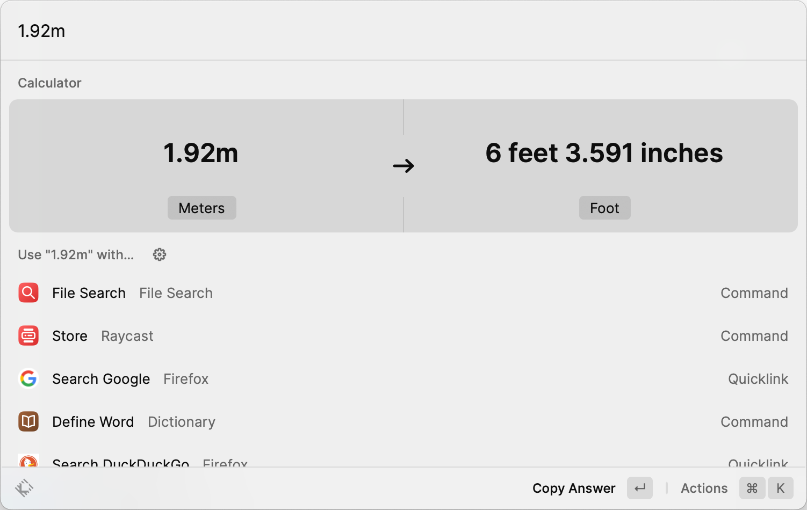
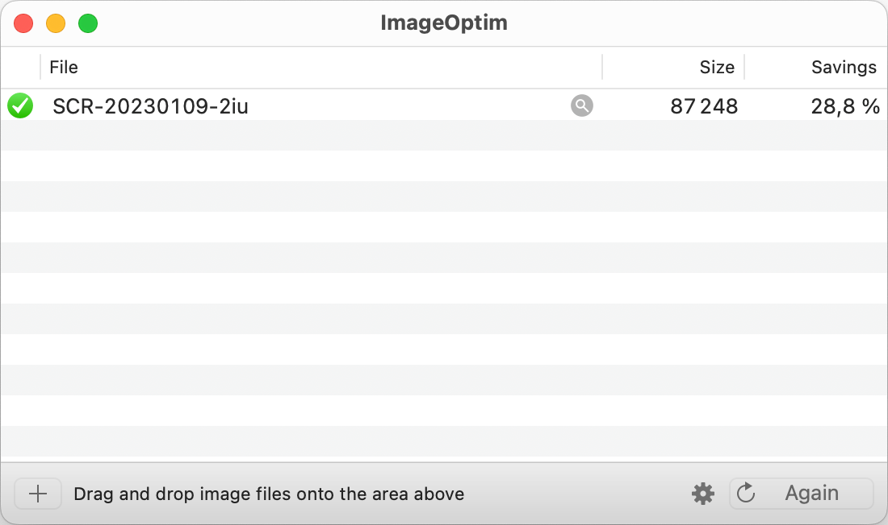
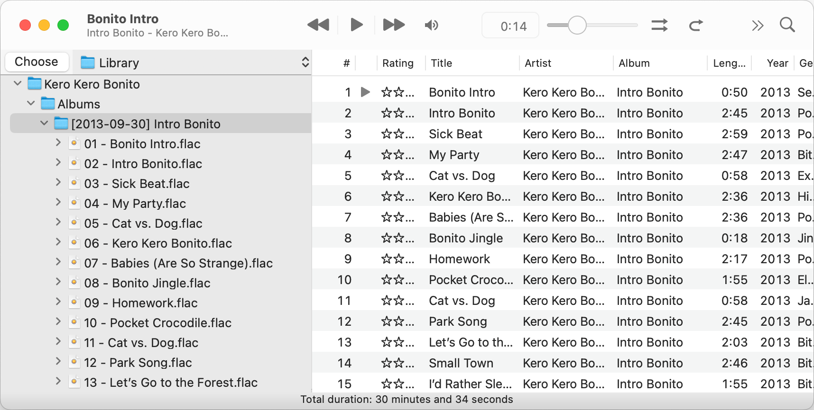
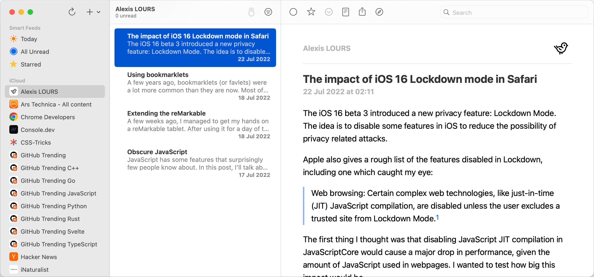
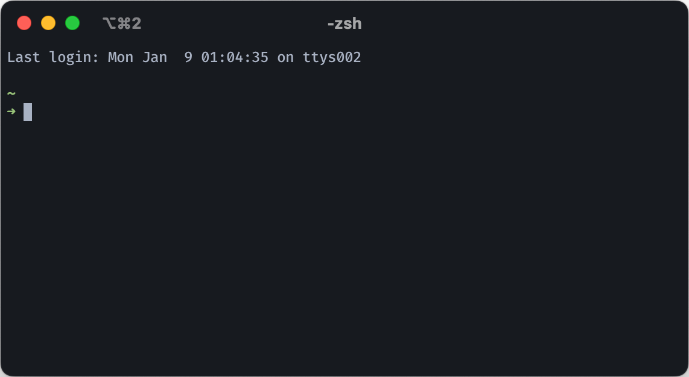
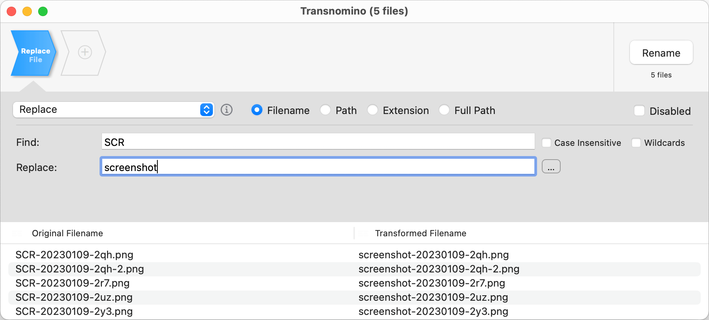

This post is intended to be a list of apps I frequently use on macOS for work and personally. It's not intended to be a list of the best apps for a specific task, but rather a list of apps I often use and like.

The list is in no particular order and some of these apps are not free.

## Table of contents

## CLI

### Homebrew

[Homebrew](https://brew.sh/) is a package manager for macOS. It allows installing and updating packages from the command line.

I use it to manage all the other CLI tools I use, desktop apps and also fonts.

### ZStandard

[ZStandard](https://github.com/facebook/zstd) is a compression algorithm made by Facebook. I use it when I need to compress anything that I don't intend to share with anyone else.

For example, to compress a folder, I would use:

```
$ tar -cf folder.tar alexi.sh
$ zstd -r --rm -T0 -19 folder.tar
```

### Exa

[Exa](https://github.com/ogham/exa) is a drop-in replacement for `ls` made in Rust with a more colorful output.

I use it with the following aliases:

```bash
alias ls='exa --color=always --group-directories-first'
alias lsal='exa -al --color=always --group-directories-first'
alias lsa='exa -a --color=always --group-directories-first'
alias lsl='exa -l --color=always --group-directories-first'
alias lst='exa -T --color=always --group-directories-first'
alias lsat='exa -aT --color=always --group-directories-first'
```

### Bat

[Bat](https://github.com/sharkdp/bat) is a drop-in replacement for `cat` with syntax highlighting and Git integration. I mostly use it to view files in the terminal.

### Atuin

[Atuin](https://github.com/ellie/atuin) is a shell history tracker. It has a lot of features like fuzzy search, auto-completion and more.

### htop

[htop](https://github.com/htop-dev/htop) is a system monitor for the terminal. It allows you to see what processes are running and their resource usage at a glance.

### jq

[jq](https://github.com/stedolan/jq) is a command-line JSON processor. It allows you to filter, transform and query JSON data.

### Neovim

[Neovim](https://github.com/neovim/neovim) is a fork of Vim. It's a text editor that allows you to edit files in the terminal. I use it mostly for editing configuration files and editing files on remote servers.

### yt-dlp

[yt-dlp](https://github.com/yt-dlp/yt-dlp) is a fork of youtube-dl with more features and bug fixes. It's a command-line tool that allows you to download videos from YouTube and other sites.

### topgrade

[topgrade](https://github.com/topgrade-rs/topgrade) is a tool that allows you to upgrade all your packages and tools with a single command. It supports a lot of different tools and package managers. I use it to upgrade Homebrew, NPM packages, Cargo packages and most other tools I use.

### Starship

[Starship](https://github.com/starship/starship) is a cross-shell prompt written in Rust. It allows you to customize your prompt with a lot of different modules. I use it to show the current directory, Git branch, and command run time.

### ripgrep

[ripgrep](https://github.com/BurntSushi/ripgrep) is a command-line search tool alternative to `grep` used to search for text in files.

## Desktop apps

### Raycast

[Raycast](https://raycast.com/) is a replacement for Spotlight. It allows you to search for files, apps, bookmarks, and more. It has a plugin system with a ton of integrations. Raycast is also better at handling unit conversions than Spotlight, which is one of my main use for it.



### ImageOptim

[ImageOptim](https://imageoptim.com/mac) is a tool that allows you to compress images. It uses a lot of different compression algorithms to compress PNG, JPEG, GIF, and SVG files with a simple drag and drop interface.



### Rectangle

[Rectangle](https://rectangleapp.com/) is a window manager for macOS. It allows you to resize and move windows with keyboard shortcuts. It also allows you to snap windows to the left, right, top, bottom, or center of the screen like on Windows.

### Cog

[Cog](https://cog.losno.co/) is a music player for macOS that can be compared to Foobar2000 on Windows.



### Visual Studio Code

[Visual Studio Code](https://code.visualstudio.com/) is a code editor made by Microsoft. It's the main editor I use for writing code.

### NetNewsWire

[NetNewsWire](https://ranchero.com/netnewswire/) is an RSS reader for macOS. I use it to read RSS feeds from my favorite websites.



### iTerm2

[iTerm2](https://iterm2.com/) is a terminal emulator for macOS. It's the only terminal emulator I use on macOS.



### Shottr

[Shottr](https://shottr.cc/) is a screenshot tool for macOS. It allows you to take screenshots of a specific window, a specific area, or the entire screen. I also often use it to for its OCR tool and annotation features.

### The Unarchiver

[The Unarchiver](https://theunarchiver.com/) is an archive manager for macOS. It allows you to extract files from ZIP, RAR, 7z, and other archive formats that Finder doesn't support.

### Transnomino

[Transnomino](https://transnomino.com/) is a tool that allows you to rename files in bulk. It has a lot of different features like appending to file name, renaming files based on regular expressions, and more.



### ForkLift

[ForkLift](https://binarynights.com/) is a file manager for macOS. I use it for its integration with remote servers as an alternative to FileZilla.
