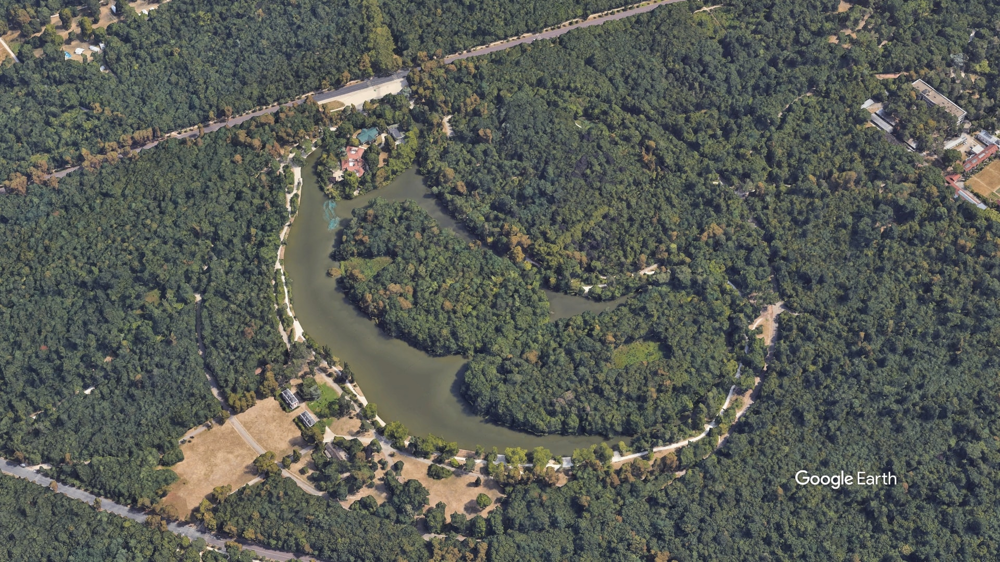
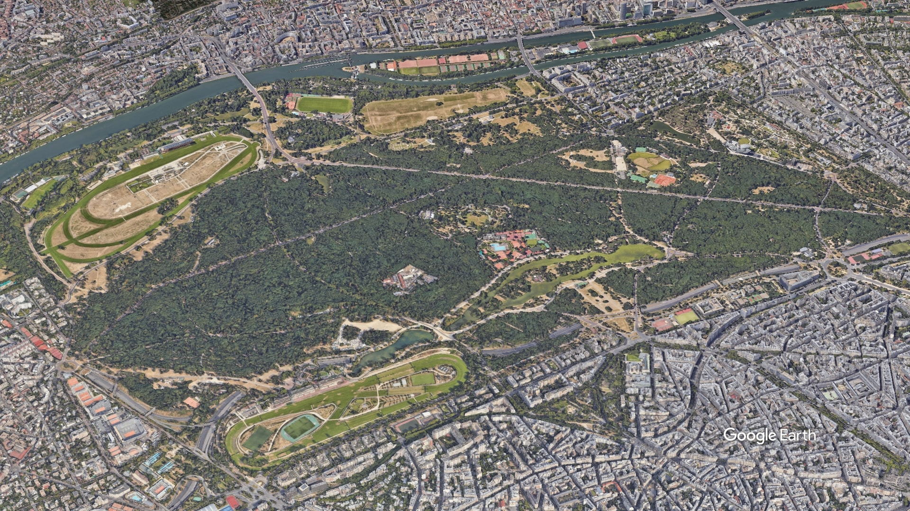
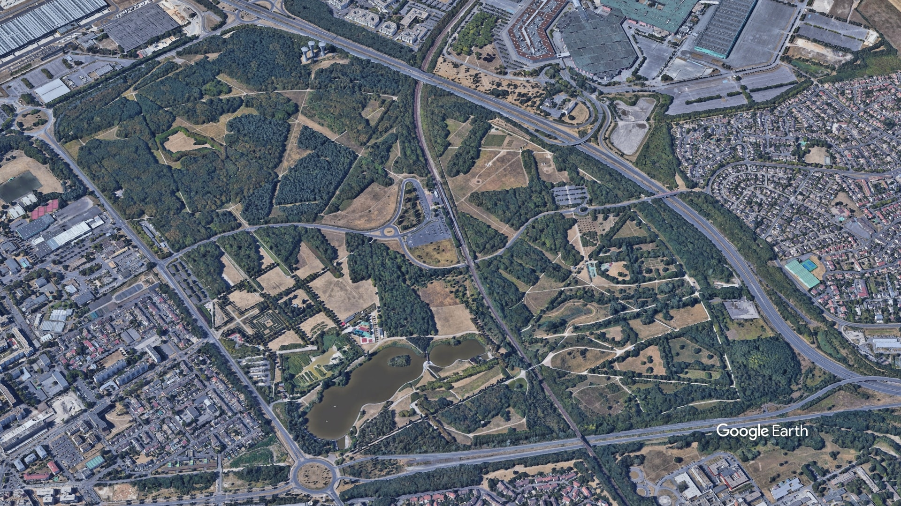
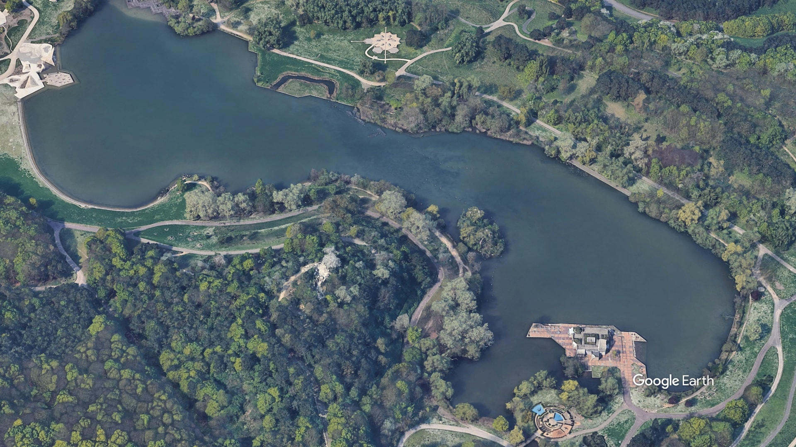

import Callout from "@components/Callout.astro";
import PublicTransports from "@components/PublicTransports.astro";

To be completely upfront, I don't think Paris and its surroundings are great places for birding.
The city itself is a concrete jungle, and the surrounding area is mostly farmland.
There are a few good spots, but you'll have to travel a bit to get to them.

I've been birding around Paris for a few years now and I've decided to create this list of the best places I've found so far for people who are interested in birding in the area.

This list will only include places inside the Ile-de-France region, which is the administrative region that includes Paris and its suburbs. It is also highly opinionated and based on my own experience.

Pictures of birds are my own and were taken in the place they are associated with. The "common species" only includes species you're likely to see, and is not an exhaustive list of all the species present in the area.

## Table of contents

## Paris proper

All the following location will be located inside Paris proper and can be accessed with a metro ticket.

### Bois de Vincennes

The Bois de Vincennes is the largest park in Paris with a few notable birding spots.

It can be accessed from the Château de Vincennes metro station (<PublicTransports text="1" color="#EDA60A"/>).

#### Château de Vincennes

The Château de Vincennes is a medieval castle built in the 14th century and was a residence of French kings. It can be visited for a 9.5€ fee at the time of writing but walking around the castle is free.

<Callout
  type="warning"
  text="You might be refused entry inside the castle if you carry a large telephoto lens because it is located next to a military base."
/>

Eurasian Kestrels nest on the walls of the castle in April and May but are present to a lesser extent all year round.

**Common species**:

- Eurasian Kestrel
- Carrion Crow
- Eurasian Magpie

#### Lac des Minimes

Roughly 25 minutes away from the Château de Vincennes, the Lac des Minimes is a lake inside the forest.

It's relatively easy to find spot where you can get down to the water level and get closer to the birds.

**Common species**:

- Canada Goose
- Mandarin Duck
- Eurasian Coot
- Common Moorhen
- Great Crested Grebe
- Common Pochard
- Rose-ringed Parakeet
- Wood Duck
- Great Cormorant
- Grey Heron

#### Lac Daumesnil

The Lac Daumesnil is a lake inside the forest. It's a bit further away from the Château de Vincennes than the Lac des Minimes but it's still easily accessible.

If you want to get directly to the lake, you can get off at the Porte Dorée metro station (<PublicTransports text="8" color="#C66AB1"/>).

It's also close to the Paris Zoological Park.

**Common species**:

- Canada Goose
- Mute Swan
- Eurasian Coot
- Carrion Crow
- Eurasian Magpie
- Black-headed Gull
- Bar-headed Goose
- Barnacle Goose
- Indian Peafowl (Captive population)
- Mallards

### Bois de Boulogne

The Bois de Boulogne is the second largest park in Paris and is located on the western side of the city.

It can be accessed from the Porte Dauphine metro station (<PublicTransports text="2" color="#273CBC" isWhite={true}/>) or the Ranelagh station (<PublicTransports text="9" color="#A8B306"/>).

<Callout
  type="danger"
  text="Avoid visiting the park at night for safety reasons, especially if you carry any kind of photography gear."
/>

**Common species**:

- Grey Heron
- Mandarin Duck
- Mallard
- Canada Goose
- Mute Swan
- Great Cormorant
- Eurasian Coot
- Bar-headed Goose
- Carrion crow

#### Lac Inférieur

The Lac Inférieur is a lake inside the park.

A lucky encounter with a Common Kingfisher.

### Parc des Buttes-Chaumont

The Parc des Buttes-Chaumont is a park located in the 19th arrondissement of Paris.

It can be accessed from the Botzaris metro station (<PublicTransports text="7B" color="#5FC285"/>).

**Common species**:

- Canada Goose
- Carrion Crow
- Grey Heron
- Common Moorhen
- Rose-ringed Parakeet
- Greylag Goose
- Mallard
- Eurasian Sparrowhawk

## Ile-de-France

These locations are outside of Paris proper and will often require a train ticket to access.

### Parc des Chanteraines

This is probably my favorite place to go birding in the Paris area. I've observed 60+ species in this park alone. It's a medium-sized park located in the northwestern suburbs of Paris.

It can be accessed from the Gennevilliers RER station (<PublicTransports text="C" color="#F8C300"/>).

**Common species**:

- Common Tern (Summer)
- Black-headed Gull
- Little Grebe
- Great Crested Grebe
- Canada Goose
- Common Kingfisher
- Long-tailed Tit
- Common Moorhen
- Herring Gull
- Yellow-legged Gull
- Caspian Gull
- Great Cormorant
- Eurasian Magpie
- Mute Swan
- Eurasian Sparrowhawk

#### Lac des Chanteraines

The main lake of the park is a great place to observe birds. There are 3 observation huts around the lake that allow you to get closer to the birds.

During summer, the lake is a nesting ground for Common Terns. Common Kingfisher and Little Bitterns are also known to nest in the park, but rarer to see.

### Parc Départemental de L'İle-Saint-Denis

A long strip of land in the middle of the Seine, this park is located above the Parc des Chanteraines.

It can be accessed from the Épinay-sur-Seine RER station (<PublicTransports text="C" color="#F8C300"/>).

**Common species**:

- Grey Heron
- Great Cormorant
- Black-headed Gull
- Canada Goose
- Mute Swan

### Parc départemental du Sausset

The Parc du Sausset is a large park located in the northeastern suburbs of Paris.

It can be accessed from the Villepinte RER station (<PublicTransports text="B" color="#417DBF" isWhite={true}/>).

**Common species**:

- Egyptian Goose
- Grey Heron
- Great Cormorant
- Black-headed Gull
- Great Crested Grebe
- Little Grebe
- Little Egret
- Common Tern (Summer)
- Barn Swallow (Summer)
- Bank Swallow (Summer)

#### Lac du Sausset

The main lake of the park is a great place to observe birds. There is an observation hut with a view on the bog.

### Parc départemental Georges-Valbon

The third largest park in the Paris area, the Parc Georges-Valbon is located in the northeastern suburbs of Paris.

<Callout
  type="danger"
  text="For safety reasons, avoid visiting this park alone with camera gear. Best visited in a group of 2 or 3 people."
/>

**Common species**:

- Tufted Duck
- Mallard
- Northern Shoveler
- Common Pochard
- Great Crested Grebe
- Little Grebe
- Grey Heron

#### Île des Hérons Cendrés

The main lake in the park has a small island called the "Île des Hérons Cendrés" (Island of the Grey Herons). It's a nesting ground for Grey Herons in the spring and can be a great spot to observe parents feeding from very close.

#### Lacs supérieurs

The lacs supérieurs (upper lakes) are a series of lakes located in the northern part of the park. They are a great place to observe waterfowl.

### Lac de Créteil

The Lac de Créteil is a lake located in the southeastern suburbs of Paris.

It can be accessed from the Créteil - Pointe du Lac metro station (<PublicTransports text="1" color="#EDA60A"/> + <PublicTransports text="8" color="#C66AB1"/>).

**Common species**:

- Great Crested Grebe
- Grey Heron
- Red-crested Pochard
- Goldcrest
- Green Woodpecker
- Common Merganser
- Reed Bunting
- Great Cormorant
- Mute Swan
- Canada Goose

### Château de la Chasse

The Château de la Chasse is a small castle located in the Forêt de Montmorency. It's a great place to observe woodland birds and one of the only place in France where Red-billed Leiothrix can be observed.

This place is only accessible by car.

### Forêt de Fontainebleau

The Forêt de Fontainebleau is a large forest located south of Paris. The forest contains a lot of trails and is a great place to observe woodland birds.

It can be accessed from the Fontainebleau-Avon train station (<PublicTransports text="R" color="#ED8AA2"/>).

#### Plaines de Sorques

The plaines de Sorques are series of lakes in the southern part of the forest. Four observation huts are located around the lakes.

**Common species**:

- Common Kingfisher
- Great Egret
- Tufted Duck
- Honey Buzzard

### Réserve naturelle régionale du Grand-Voyeux

The Réserve naturelle régionale du Grand-Voyeux is a nature reserve located in the northeastern suburbs of Paris.

It can be accessed in train and bus (<PublicTransports text="P" color="#EB7941"/> to Meaux + Bus <PublicTransports text="R" color="#6ABB85"/> to Mairie stop).

<Callout
  type="warning"
  text="You need to book any trips a few days ahead (for free) on their website."
/>

**Common species**:

- Bluethroat
- Reed Bunting
- Eurasian Marsh-Harrier
- Tufted Duck
- Green-winged Teal
- Gadwall
- Black Kite
